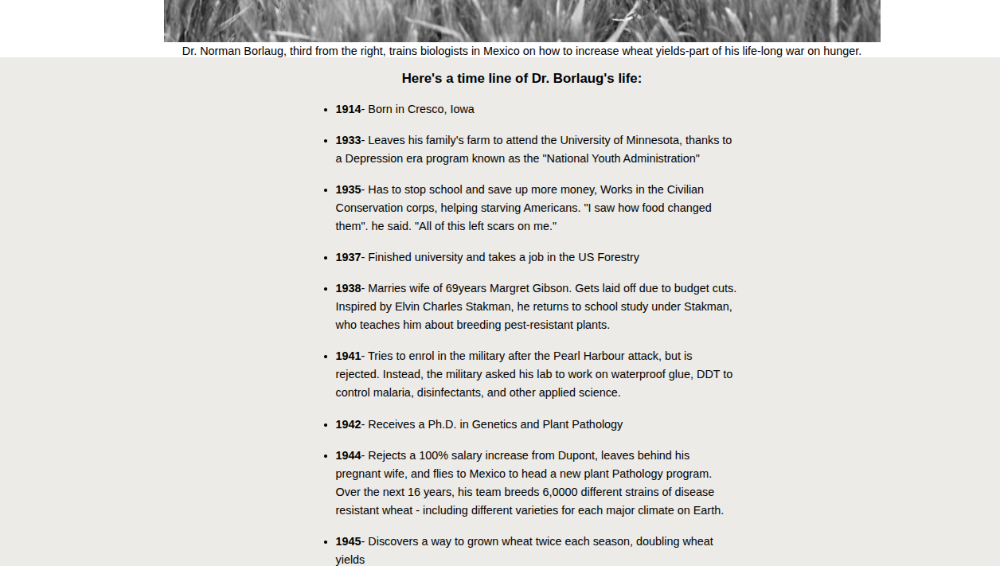

# Tribute Page

## Description
 A simple HTML web page paying tribute to the great **Dr Norman Borlaug** who used his agrology expertise to help feed billions of starving population all over the world.

 This web page includes a *tribute image* and *an unordered list* documenting the timeline of Dr Norman like the sample screenshot below.
```html
     <div class="timeline">
            
                <h3 id="timeline-heading">Here's a time line of Dr. Borlaug's life: </h3>
                <ul class="unordered-list">

                    <li><strong>1914</strong>- Born in Cresco, Iowa</li><br>
                    <li><strong>1933</strong>- Leaves his family's farm to attend the University of Minnesota, thanks to a 
                        Depression era program known as the "National Youth Administration"
                    </li><br>
                    <li><strong>1935</strong>- Has to stop school and save up more money, Works in the Civilian Conservation
                        corps, helping starving Americans. "I saw how food changed them". he said. "All of this left scars on me."
                    </li><br>
                    <li><strong>1937</strong>- Finished university and takes a job in the US Forestry</li><br>
                    <li><strong>1938</strong>- Marries wife of 69years Margret Gibson. Gets laid off due to budget cuts. Inspired
                        by Elvin Charles Stakman, he returns to school study under Stakman, who teaches him about breeding
                        pest-resistant plants.
                    </li><br>
                    <li><strong>1941</strong>- Tries to enrol in the military after the Pearl Harbour attack, but is rejected. Instead, the 
                        military asked his lab to work on waterproof glue, DDT to control malaria, disinfectants, and other
                        applied science.
                    </li><br>
                    <li><strong>1942</strong>- Receives a Ph.D. in Genetics and Plant Pathology</li><br>
```



## Author
**Love Asoh**

- GitHub: [@loveasoh](https://github.com/AsohLove)
- Twitter: [@loveasoh](https://x.com/LoveTheModifier)
- LinkedIn: [love asoh](https://www.linkedin.com/in/asohlove/)


## License
This project is [MIT](./LICENSE) licensed.